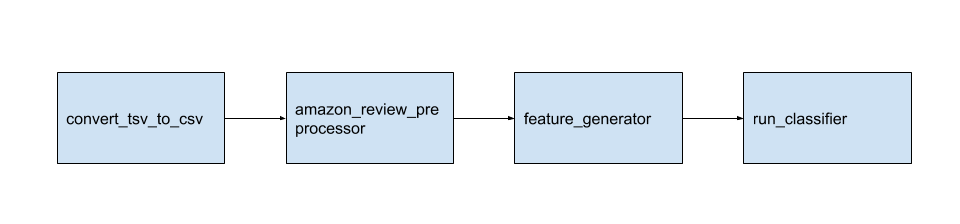

# Notesbook

This directory contains mostly summary notebooks of various models that were executed

I explored traditional ML models as well as deep learning models for this project.

Configuration files and reports are checked into the repository so we can reproduce the results later.

Notebooks are numbered in the order they were done

Unfortunately because of github repo limits, I could not check in all data files

## Traditional ML Model 

### Prototypes

Unfortunately when I first started on this project jupyter notebook was not stable and my model runs would hang and never finish. So I created python programs to do the bulk of running the sklearn models (see below for workflow).

All python programs are located in *tools* directory




## Deep Learning

Deep learning notebooks were executed on Google Colab and checked into the repository since they require a GPU

Notebooks as well as reports are checked into this repo

## Training Entire Dataset

To train the entire dataset with trandtion ML model, I took the best perfroming model and used Pyspark via Jupyter notebooks to train the entire dataset. The notebooks are located in the pyspark directory. These notebooks create a report with similar format as deep learning notebooks so we can load them in notebooks for comparison.

```diff
- For DL model, TBD
```

## Directory Structure

```buildoutcfg
root - summary notebooks of our findings
├── exploratory - all exploratory notebooks
├── deep_learning - google colab notebooks used for deep learning
├── pyspark - pyspark notebook to train our model with entire dataset
├── retired - old notebooks - you can ignore these
├── tests - scratch pad space for tests (you can ignore this)
```

## Running from command line

Sometime I would re-run notebooks via the command line. You can do that using *../scripts/runAllNotebooks.sh*

### Usage
```bash
Use this script to run notebooks from the command line. By default, notebooks will be overwritten with the output (including errors)
If -n is note specified, this will run all notebooks in the directory
../tools/runNotebooks.sh: [-d run all notebooks in debug] [-n <notebook> specific notebook or a pattern for notebooks] [-c when running in debug mode, us this to delete temp notebooks]
Example:
  ../tools/runNotebooks.sh
  ../tools/runNotebooks.sh -n notebook.ipynb
  ../tools/runNotebooks.sh -n 3*.ipynb
```


