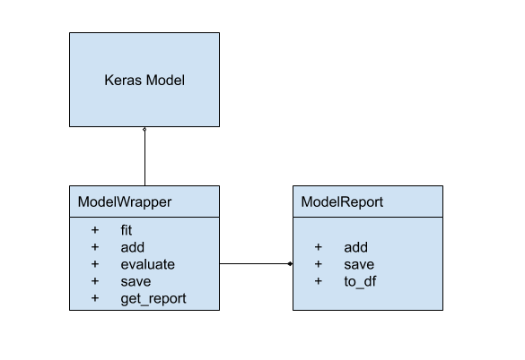

# Deep Learning Notebooks

All notebooks are Google Colab notebooks so I can make use of their GPU for training

All models are implemented in TF2/Keras

All models are wrapped in a ModelWrapper to take care of common functions:

* recording times - training, predict, etc
* save models and weights to Google Drive - Springboard/capstone/reports
* record results - ie, classification report, confusion matrix



## Reports

All notebooks write reports to the following directory on Google Drive:

```buildoutcfg
Springboard/capstone/reports
```


# Google Drive Setup

In order to run these notebooks you will want to create the following directories in your Google Drive

```buildoutcfg
├── Springboard - main directory
    ├── capstone - main directory for this project
        ├── data - put your data files here
        ├── reports - all notebooks will store results in this directory
        ├── util - copy ../util*.py files here
```

# Local Setup

You will want to install Google Drive on your local machine and at least sync the Springboard directory. You can download it here: https://www.google.com/drive/download/

To sync Google Colab notebooks to your repository, run the following command:

```bash
../scripts/syncGoogleDrive.sh
```

The script does the following:
* sync ../util to Google Drive
* sync reports from Google Drive to reports directory

Once files are synced, you can check them into git by running *git add <filename>*

# Checking in Notebooks

Apparently, Google Colab saves notebooks in a slightly different format (ie missing link to Google Colab) so syncing them direclty from Google Drive to local repo doesn't work. You will want to save them directly to Github in Google Colab using File > Save a copy to GitHub
