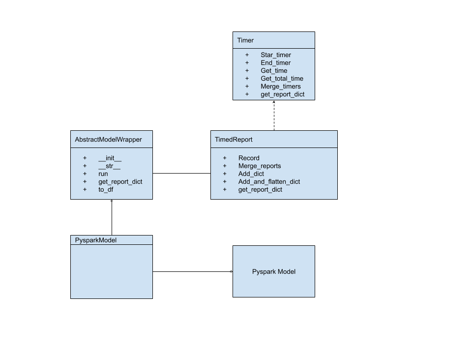

# PySpark Notebooks

This series of notebooks uses PySpark to train Logistic Regression on the full Amazon review dataset

# PysparkModel

All notebooks use the PySparkModel class abstraction to do common things:

* time events
* calculate metrics - ie, classification report
* save models
* write report

# Running Notebooks

All notebooks were executed on a Docker container with Pyspark installed. For instructions please see *../../pyspark* directory