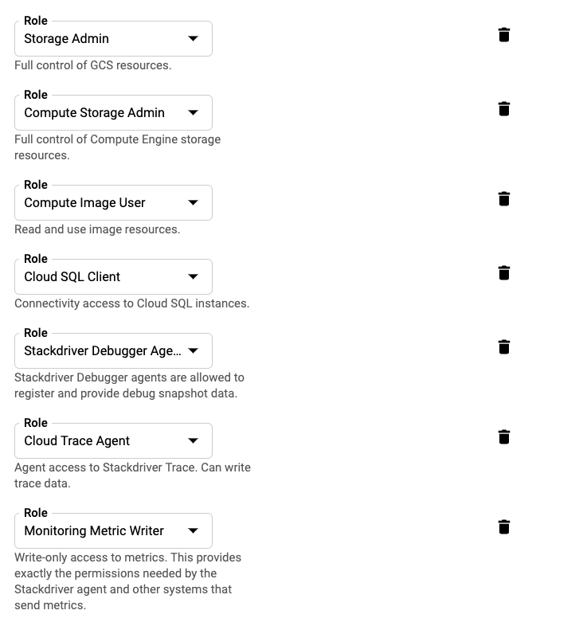

# Amazon Review Classification Service

This is implemented as a flask server using flask, SQLAlchemy, and flask-restplus (Swagger UI) that deploys a trained model to GCP

The project uses the following GCP resources:
* Cloud Storage - stores configuration and saved models
* Cloud MySQL Database(SSL) - prediction history database
* Kubernetes Engine - 1 node k8 cluster
* GCP Compute Instance - VM to deploy our Docker container
* GCP Container Registry - Docker container


## Files and Directories

* notebooks/ - jupyter prototype notebooks
* util/ - python utility classes
* templates/ - flask templates
* tests/ - unit tests
* config/ - contains a sample json config for one of our models (for development)
* gcp.sh - utility script to make GCP project setup easier
* gcp_vars.sh - environment variables for GCP project - will want to edit this with info from your project
* review.py - main Flask application
* run_service.sh - script to run our flask server. This will also be used by our Docker container
* requirements.txt - pip requirements file

# Prerequisites

Please install the following

* [Google Cloud SDK](https://cloud.google.com/sdk/docs/downloads-interactive) - gcp.sh relies on this
    * [Quickstart For MacOS](https://cloud.google.com/sdk/docs/quickstart-macos)
* Docker CE
* MySQL client
```bash
brew install mysql
```


# Project Setup

```bash
python -m venv .
source bin/activate
pip install -r requirements.txt

```

Optionally, you can use install virtualenv and create a python virtual environment before installing requirements for the project


## One Time GCP Project Setup


You will need to do the following to setup your GCP project:

* Create your GCP project
* Make sure billing is enabled
    * **Update** *gcp_var.sh* and set project name, project ID, zone, region
* Create your service account and put key (gcp-key.json) in credentials/ (see below)
* Create your SSL certificates for database and place in credentials/


At the end of this, your *credentials/* should have the following files:
* client-cert.pem
* client-key.pem
* server-ca.json
* gcp-key.json


Log into gcp account from terminal

```bash
gcloud auth login
```

### Service Accounts
Flask server uses GCP python libraries to access GCP resources. You will need to create a service account and grant at least the following roles:



NOTE: I created my service accounts on GCP manually through GCP console. However, you can use gcloud cli to do this. See [Creating and managing service account](https://cloud.google.com/iam/docs/creating-managing-service-accounts)

You will also want to put your service account key, name it *gcp-key.json* and place it in *credientials/* directory. See [Creating and managing service account keys](https://cloud.google.com/iam/docs/creating-managing-service-account-keys)
See also, [Download Service Account Keys](https://cloud.google.com/iam/docs/creating-managing-service-account-keys#iam-service-account-keys-create-gcloud)

### Create Cloud MySql Database

```bash
./gcp.sh db_create
```

NOTE: make sure DB_INSTANCE_NAME is set in gcp_var.sh

### Cloud MySql Certificates

In order for the flask server to communicte with MySQL over SSL, you will need to generate a certificate and download all keys and certificates into *credentials/* directory:

See [Managing your client certificates](https://cloud.google.com/sql/docs/mysql/configure-ssl-instance)

# GCP Script

I found that I was running the same commands during development so decided to write a script to help with GCP setup and teardown while I was developing

```bash
$ ./gcp.sh help
Usage: ./gcp.sh <cmd> [cmd params]
Available cmd's
     bucket_copy - copy model files to file bucket sb-capstone-bucket
     bucket_create - create file bucket sb-capstone-bucket
     bucket_delete -  delete file bucket sb-capstone-bucket
     cluster_start - create a k8 cluster and deploy container to this cluster. The container needs to exist. You should run <image_upload> job before
     cluster_stop - shutdown project
     db_create - creates database. You only need to call this once at the begging of the project
     db_delete - deletes database from GCP completely. GCP will not allow you to use the same name for 7 days
     db_stop - shutdown database
     db_start - start already instantiated database
     image_delete - delete all images from our GCP container registry
     image_deploy - specify a new version of container to deploy to k8 cluster
     image_upload - tag docker image and upload. Requires additional <version to tag image> <docker image id>
     setup - initialize project
     start_all - Calls setup, bucket_copy image_deploy, and cluster_start. Requires additional <version to tag image> <docker image id>
     teardown - opposite of setup - will teardown or shutdown gcp resources for the project
              currently, this does the following: db stop, file bucket delete, stop k8 cluster
```

NOTE: I wrote this on a Mac using bash. I think it should work on other *nix environments but have not tested it


# Running the service

There are 3 ways you can run the service:

## For Local Development
For local development, you can run the flask service directly or through Docker container using docker-compose.

All cases connect to Cloud MySql database over SSL on GCP and requires you to set this up beforehand (see above)

### Running flask service directly through python

This method does the following:
* loads models from local file system from *models/* directory using LocalModelBuilder

```bash
source gcp_vars.sh
./run_service.sh

```

### Run flask service via Docker

This method does the following:
* loads models from GCP bucket using GCPModelBuilder
* volume mounts the current directory to docker container so any changes done in local file system will be picked up on the flask server


```bash
source gcp_vars.sh
docker-compose build
docker-compose up

```


# Running and deploying service on GCP

Do the following to deploy your service as well as any other associated files and containers to GCP

```bash
source gcp_vars.sh
docker-compose build # if you haven't built the latest version of your container already
./gcp.sh start_all 

```

To get your docker image hash to deploy run:
```bash
docker images
```

# Accessing Your Service

I used restplus which gives you a Swagger UI. You can use this to test your service


Hit the following URL's on your browser

## Local and Local Docker Image
```bash
http://localhost:5000
```

## GCP
```bash
http://<your k8 cluster external IP>
```
This runs on port 80 so you don't have to specify port. You can get get the external IP by running:
```bash
kubectl get services
```

# Cleaning Up Your Project

To avoid extra charges, run the following will shutdown all resources and services on GCP

```bash
./gcp.sh teardown # shuts down all resources
```


Alternatively, if you do not need everything shut down. Please use one of the *stop*/*delete* commands in *gcp.sh*


NOTE: There are a few things not quite working - you will want to manually clean these up using GCP console. Please see Known Issues section


### GCP Reference links:


# Known Issues 

* gcp.sh is not releasing static IP's properly when you run *teardown* - you will have to manually remove these to avoid extra charges
* cannot for the life of me to get logging working under flask despite many attempt. Some classes are not logging at all and some are. model_util is logging under the main flask app logger

# Future Updates
* Currently, flask server communicates with Cloud MySQL over external IP. This offers flexibility switching between development and production, however, it is more ideal to connect to database over VPC when running on GCP
* Flask server only logs to STDOUT current. Would like it to log to StackDriver when the container is running on GCP